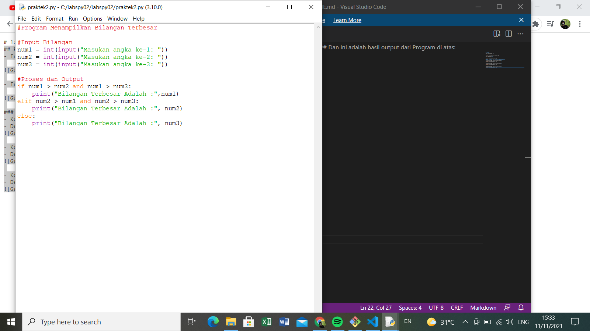
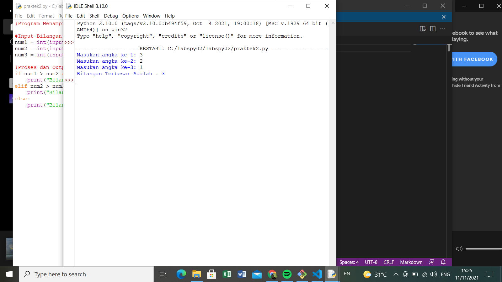
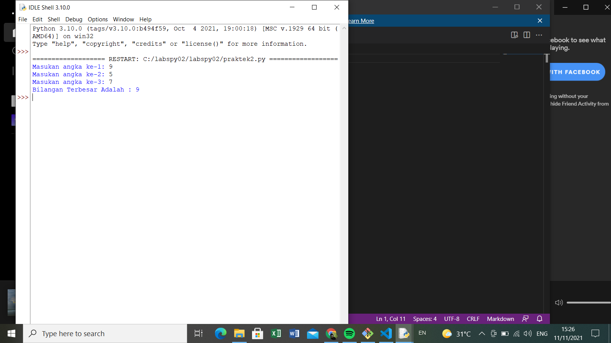

# labspy02
## Praktek 2
- Ini Flowchartnya 

- Ini Codinganya 

### Dan ini adalah hasil output dari Program di atas:
- Kondisi 1, angka 1 adalah angka terbesar

- Dengan input 3,2,1

- Kondisi 2, angka 2 adalah angka terbesar

- Dengan input 1,3,2

- Kondisi 3, angka 3 adalah angka terbesar

- Dengan input 1,2,3

